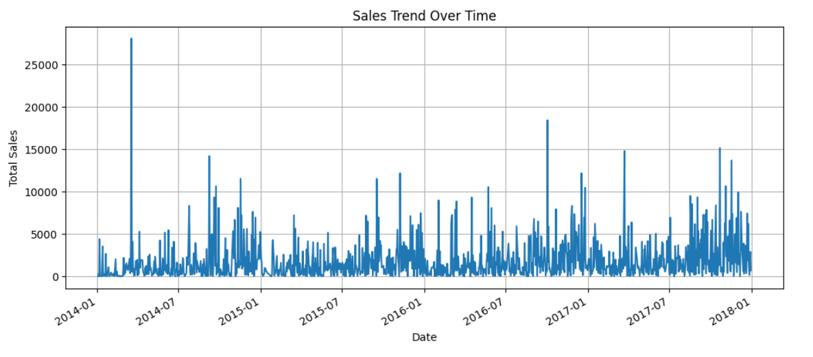
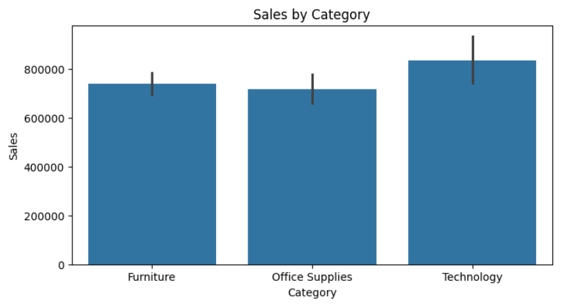
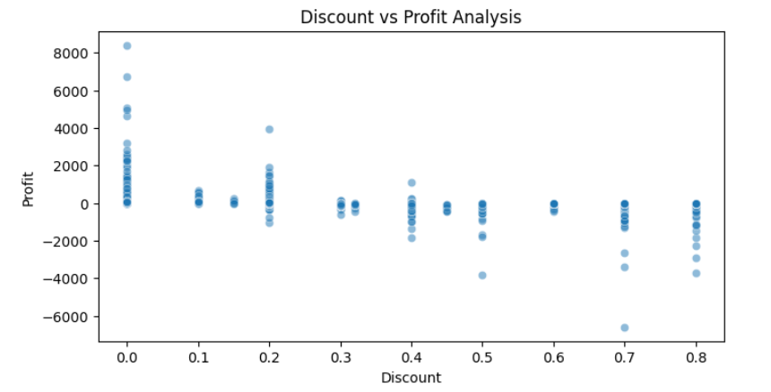
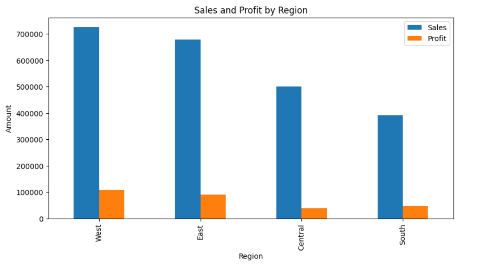
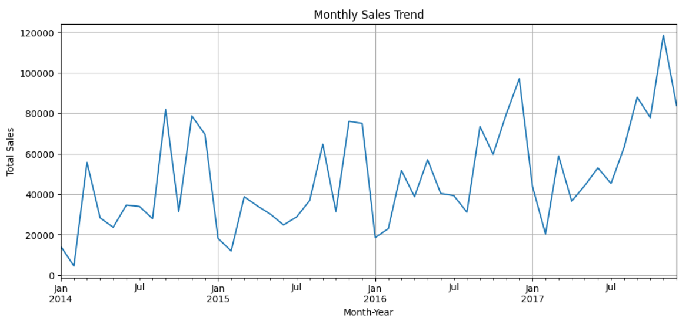
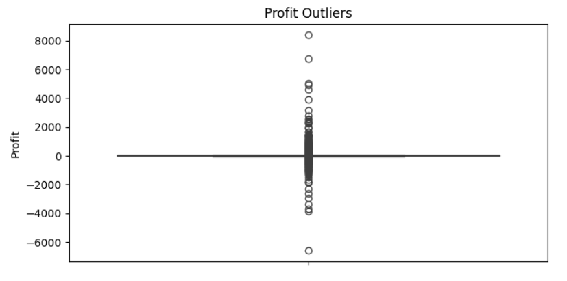

# Sales Data Analysis

## 📌 Project Overview

This project analyzes a sales dataset from Kaggle to identify key insights, trends, seasonal patterns, and anomalies. The analysis involves data preprocessing, visualizations, and extracting meaningful business insights.

## 🛠️ Technologies Used

- **Python** (Pandas, NumPy, Matplotlib, Seaborn)
- **Jupyter Notebook**
- **Data Visualization Tools**

---

## 📊 Data Analysis Steps

### 1️⃣ Sales Trend Over Time

We analyzed the total sales over time to identify any seasonal trends or significant fluctuations in revenue.



### 2️⃣ Sales by Product Category

A bar plot was used to visualize which product categories generate the most revenue.



### 3️⃣ Discount vs Profit Analysis

This scatter plot helps us understand the relationship between discount rates and profitability.



### 4️⃣ Regional Sales & Profit Analysis

Total sales and profit were aggregated for each region to find the best and worst-performing areas.



### 5️⃣ Monthly Sales Trend

A time-series analysis was conducted to see how sales vary across different months.



### 6️⃣ Profit Outliers Detection

A box plot was used to detect extreme profit or loss values that may indicate anomalies in pricing or product performance.



---

## 🔑 Key Insights

- **Sales fluctuate seasonally**, indicating potential opportunities for targeted marketing campaigns.
- **Certain product categories perform significantly better** than others, influencing inventory and sales strategies.
- **High discounts often correlate with lower profits**, highlighting the need for optimized discounting strategies.
- **Regional differences in sales and profits** suggest potential market expansion or improvement strategies.
- **Outliers in profit indicate extreme gains or losses**, necessitating further investigation.

---

## 📁 How to Use This Repository

1. Clone the repository:
   ```sh
   git clone https://github.com/Daniyal-DS/Sales-Data-Analysis
   ```
2. Install the required Python libraries:
   ```sh
   pip install pandas numpy matplotlib seaborn
   ```
3. Open and run the Jupyter Notebook:
   ```sh
   jupyter notebook
   ```
4. Analyze the dataset and visualize trends.

---

## 📢 Contributing

Feel free to fork this repository, submit pull requests, or suggest improvements. Contributions are always welcome! 🚀

---
## Dataset Reference
The dataset used in this project is available on Kaggle:
[Superstore Sales Dataset](https://www.kaggle.com/datasets/vivek468/superstore-dataset-final)

## 📝 License

This project is open-source and available under the [MIT License](LICENSE).

